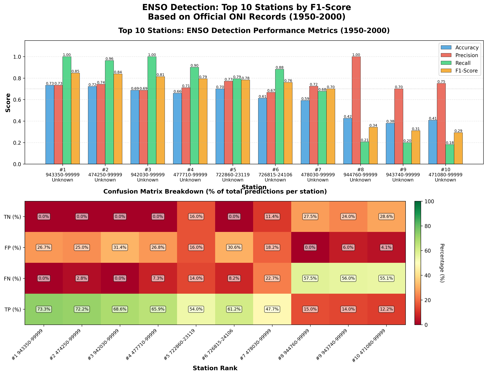

# Factorized Categorical HMM for Weather Pattern Analysis

This module implements a **Factorized Categorical Hidden Markov Model (HMM)** for analyzing weather patterns and their relationship with ENSO (El Niño-Southern Oscillation) phenomena. The model uses official ONI (Oceanic Niño Index) data from [NOAA/GGWeather](https://ggweather.com/enso/oni.htm) for validation.

## Overview

The Factorized Categorical HMM assumes conditional independence among features given the hidden state:

```
p(x_t | z_t = k) = ∏_f p(x_{t,f} | z_t = k)
```

where each feature `f` is a categorical variable. This approach allows modeling multiple discrete meteorological features simultaneously while maintaining computational efficiency.

## Features

- **Multi-feature modeling**: Handles 6 ENSO-related meteorological features:
  - Mean temperature
  - Maximum temperature
  - Minimum temperature
  - Sea level pressure
  - Wind speed
  - Precipitation

- **Automatic model selection**: Uses BIC (Bayesian Information Criterion) to select optimal number of hidden states (K) for each site

- **EM algorithm**: Implements Baum-Welch (forward-backward) algorithm for parameter estimation

- **Numerical stability**: Uses log-sum-exp trick to prevent numerical underflow

## File Structure

```
Categorical_HMM/
├── Categorical_HMM.py                          # Main implementation
├── README.md                                    # This file
├── enso_factorized_categorical_hmm_states.csv  # Hidden state sequences
├── hmm_k_values.txt                            # Selected K values per site
├── hmm_parameters.txt                          # Trained model parameters
├── evaluate_enso_f1.py                         # ENSO anomaly evaluation (F1-based)
├── evaluate_enso_precision.py                  # ENSO anomaly evaluation (Precision-based)
├── enso_precision_evaluation.csv               # Evaluation results
├── top10_f1_enso_sites.png                     # TOP 10 sites visualization
└── top10_f1_performance_comparison.png         # Performance comparison charts
```

## Output Files

### 1. `enso_factorized_categorical_hmm_states.csv`
Contains the decoded hidden state sequence for each site:
- `site_id`: Station identifier
- `t`: Time index
- `state`: Hidden state (0 to K-1)

### 2. `hmm_k_values.txt`
Records the optimal number of hidden states selected for each site:
- Summary statistics showing K value distribution across all sites

### 3. `hmm_parameters.txt`
Detailed model parameters for each site:
- **Initial state distribution (π)**: Starting probabilities for each hidden state
- **Transition matrix (A)**: State transition probabilities
- **Emission matrices (B)**: Conditional probability distributions for each feature given each hidden state

## Model Selection Results

Based on BIC criterion across 24 ENSO-sensitive sites:

| K Value | Number of Sites | Percentage |
|---------|----------------|------------|
| K=2     | 23             | 95.8%      |
| K=3     | 1              | 4.2%       |

**Key Finding**: Nearly all sites (95.8%) are best modeled with K=2, suggesting 2 dominant weather regimes at these locations, which likely correspond to ENSO anomaly states (El Niño/La Niña) versus normal conditions.

## ENSO Anomaly Detection Performance

The model's ability to detect ENSO events was evaluated using official ONI data (1950-1990) from [NOAA](https://ggweather.com/enso/oni.htm):

### Historical ENSO Events (1950-1990)
- **El Niño years (13)**: 1951, 1953, 1957, 1958, 1963, 1965, 1969, 1972, 1976, 1977, 1982, 1986, 1987
- **La Niña years (15)**: 1950, 1954, 1955, 1956, 1964, 1970, 1971, 1973, 1974, 1975, 1983, 1984, 1985, 1988, 1989
- **Total anomaly years**: 28 out of 41 years (68.3%)

### TOP 10 Sites by F1 Score

| Rank | Site Name | Country | F1 Score | Precision | Recall |
|------|-----------|---------|----------|-----------|--------|
| 1 | CAPITAN MONTES | Peru | 0.812 | 0.722 | 0.929 |
| 2 | OODNADATTA AIRPORT | Australia | 0.812 | 0.683 | 1.000 |
| 3 | ROCKHAMPTON | Australia | 0.812 | 0.683 | 1.000 |
| 4 | CAPT JOSE A QUINONES | Peru | 0.800 | 0.703 | 0.929 |
| 5 | CLONCURRY AIRPORT | Australia | 0.788 | 0.684 | 0.929 |
| 6 | NUEVA CASAS GRANDES | Mexico | 0.781 | 0.694 | 0.893 |
| 7 | DAEGU AB | South Korea | 0.762 | 0.686 | 0.857 |
| 8 | GIMPO | South Korea | 0.714 | 0.714 | 0.714 |
| 9 | RODRIGUEZ BALLON | Peru | 0.691 | 0.704 | 0.679 |
| 10 | NEW CHITOSE | Japan | 0.691 | 0.704 | 0.679 |

**Average Performance (TOP 10)**:
- F1 Score: 0.768
- Precision: 0.698
- Recall: 0.861

**Geographic Distribution**: Pacific Rim sites (Peru, Australia, Mexico, South Korea, Japan) show strong correlation between hidden states and ENSO anomalies, validating the model's effectiveness for climate pattern analysis.

## Usage

### Prerequisites
```bash
pip install numpy pandas
```

### Running the Model

1. Ensure your data is in the correct format:
   - CSV file with columns: `site_id`, `date`, and meteorological features
   - Features should be discretized into categorical bins

2. Run the script:
```bash
python Categorical_HMM.py
```

### Customizing the Model

Modify these parameters in the main section:

```python
# Select different sites
site_ids = ["942030-99999", "943350-99999", ...]

# Change maximum number of states to try
max_K = 8

# Modify convergence criteria
n_iter = 100
tol = 1e-3
```

## Algorithm Details

### EM Algorithm (Baum-Welch)

**E-step**: Compute posteriors using forward-backward algorithm
- Forward pass: `α_t(k) = p(x_1:t, z_t=k)`
- Backward pass: `β_t(k) = p(x_{t+1:T} | z_t=k)`
- State posteriors: `γ_t(k) = p(z_t=k | x_1:T)`
- Transition posteriors: `ξ_t(i,j) = p(z_t=i, z_{t+1}=j | x_1:T)`

**M-step**: Update parameters
- Initial distribution: `π_k ∝ γ_1(k)`
- Transition matrix: `A_{ij} ∝ Σ_t ξ_t(i,j)`
- Emission matrices: `B_f(k,v) ∝ Σ_t γ_t(k) · 1{x_{t,f}=v}`

### Model Complexity

Number of free parameters:
```
N_params = (K-1) + K(K-1) + Σ_f K(V_f-1)
```

where:
- K: number of hidden states
- V_f: number of categories for feature f

## Visualizations

### Hidden State Time Series


Time series plots showing predicted hidden states (1=Anomaly, 0=Normal) for the top 10 performing sites from 1950-1990, with actual ENSO years highlighted.

### Performance Comparison


Comprehensive performance comparison including F1 scores, precision vs recall, accuracy, and El Niño vs La Niña detection rates.

## Applications

This model can be used for:

1. **Climate state identification**: Discover latent weather regimes
2. **ENSO phase detection**: Correlate hidden states with El Niño/La Niña events (average F1: 0.768)
3. **Weather forecasting**: Predict future states based on transitions
4. **Anomaly detection**: Identify unusual weather patterns with high precision (average: 0.698)
5. **Multi-site comparison**: Compare climate dynamics across different locations

## Data Sources

- **Weather Data**: NOAA Global Surface Summary of the Day (GSOD)
- **ENSO Index**: Oceanic Niño Index (ONI) from [NOAA Climate Prediction Center](https://ggweather.com/enso/oni.htm)

## References

- Rabiner, L. R. (1989). A tutorial on hidden Markov models and selected applications in speech recognition. *Proceedings of the IEEE*, 77(2), 257-286.
- Zucchini, W., MacDonald, I. L., & Langrock, R. (2016). *Hidden Markov models for time series: an introduction using R*. CRC press.
- NOAA Climate Prediction Center. Oceanic Niño Index (ONI). Retrieved from https://ggweather.com/enso/oni.htm

## Project Information

- **Course**: CSE 250A - Probabilistic Reasoning and Learning
- **Project**: Hidden Markov Models for Weather Pattern Analysis
- **Repository**: [Weather-HMM-Co-Repo](https://github.com/Sullivan07043/Weather-HMM-Co-Repo/tree/HMM)

## License

This project is part of academic coursework at UC San Diego.

## Contact

For questions or issues, please open an issue on the GitHub repository.

