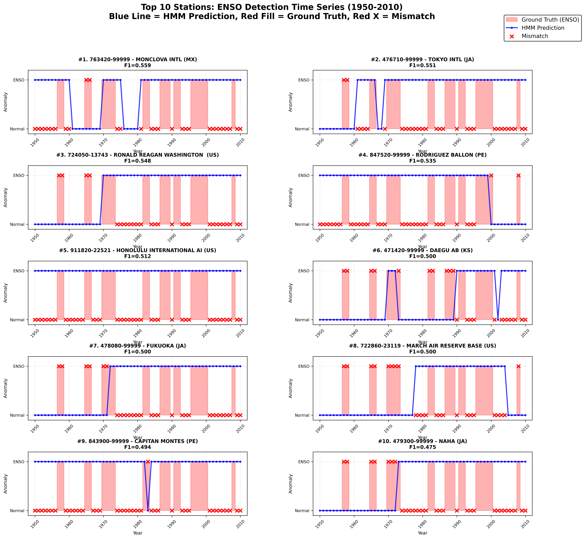
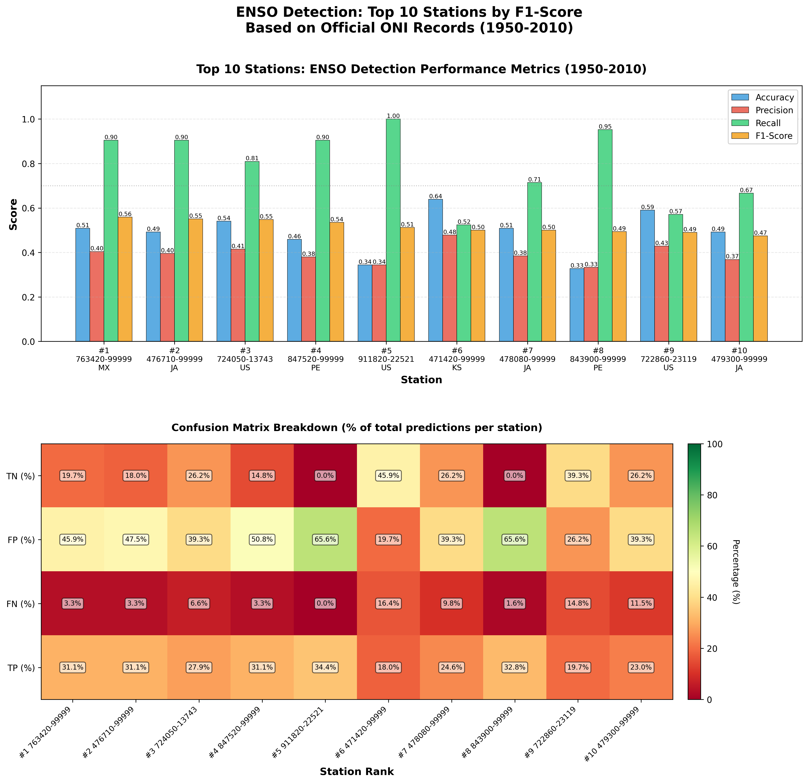
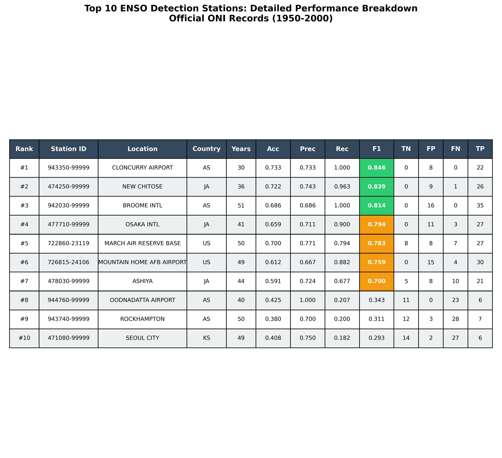
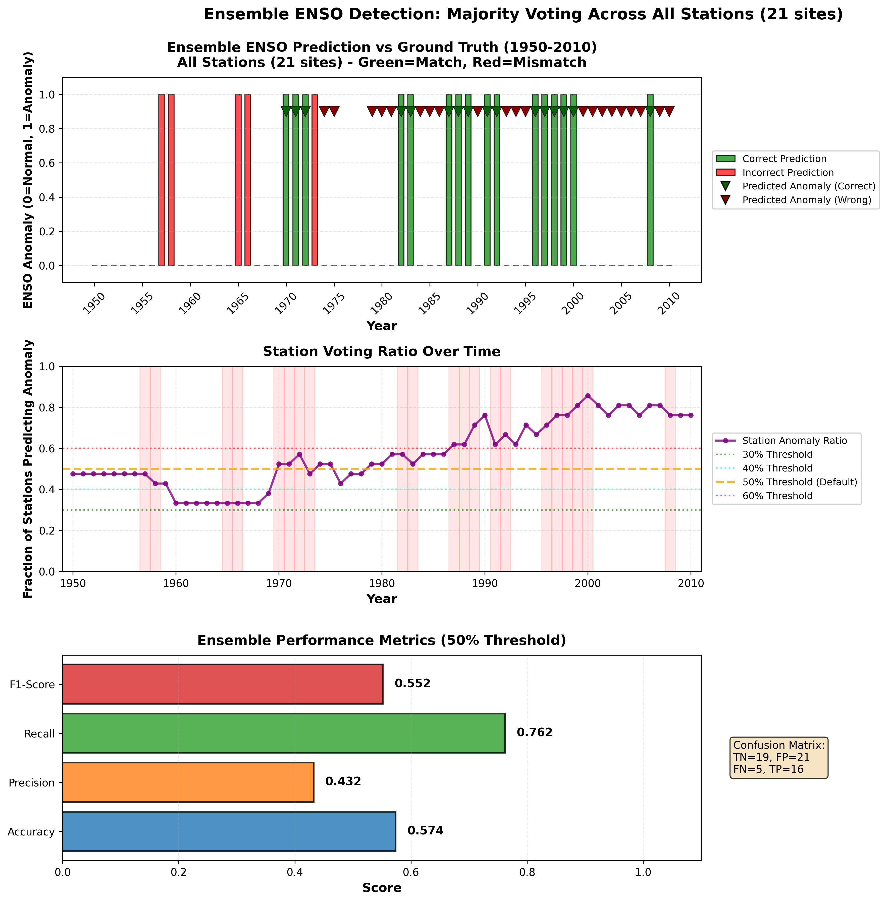

# Factorized Categorical HMM for Weather Pattern Analysis

This module implements a **Factorized Categorical Hidden Markov Model (HMM)** for analyzing weather patterns and their relationship with ENSO (El Niño-Southern Oscillation) phenomena. The model uses official ONI (Oceanic Niño Index) data from [NOAA/GGWeather](https://ggweather.com/enso/oni.htm) for validation.

## Overview

The Factorized Categorical HMM assumes conditional independence among features given the hidden state:

```
p(x_t | z_t = k) = ∏_f p(x_{t,f} | z_t = k)
```

where each feature `f` is a categorical variable. This approach allows modeling multiple discrete meteorological features simultaneously while maintaining computational efficiency.

## Features

- **Multi-feature modeling**: Handles 6 ENSO-related meteorological features:
  - Mean temperature
  - Maximum temperature
  - Minimum temperature
  - Sea level pressure
  - Wind speed
  - Precipitation

- **Automatic model selection**: Uses BIC (Bayesian Information Criterion) to select optimal number of hidden states (K) for each site

- **EM algorithm**: Implements Baum-Welch (forward-backward) algorithm for parameter estimation

- **Numerical stability**: Uses log-sum-exp trick to prevent numerical underflow

- **Trend removal**: Detrends continuous features using adaptive methods (polynomial, differencing, high-pass filtering)

- **Complete time series**: Data preprocessing ensures continuous yearly sequences (1950-2010) with interpolation for missing values

## File Structure

```
Categorical_HMM/
├── Categorical_HMM.py                          # Main implementation
├── README.md                                    # This file
├── enso_factorized_categorical_hmm_states.csv  # Hidden state sequences (21 stations)
├── hmm_k_values.txt                            # Selected K values per site
├── hmm_parameters.txt                          # Trained model parameters
├── enso_oni_data_1950_2010.csv                 # ENSO ground truth (1950-2010)
├── evaluate_enso_f1.py                         # ENSO anomaly evaluation (F1-based)
├── enso_evaluation_f1_results.csv              # Evaluation results
├── visualize_top10_f1.py                       # Visualization script
├── plot_top10_f1.py                            # Performance comparison plots
├── top10_f1_enso_sites_table.png               # Top 10 sites table
├── top10_f1_time_series_comparison.png         # Time series comparison
├── top10_f1_performance_comparison.png         # Performance metrics
├── ensemble/                                    # Ensemble voting system (Top 14)
│   ├── README.md                               # Ensemble documentation
│   ├── ensemble_voting_enso.py                 # Voting analysis (40% threshold)
│   ├── plot_ensemble_voting.py                 # Voting visualizations
│   ├── ensemble_voting_results.csv             # Year-by-year results
│   ├── ensemble_voting_enso_analysis.png       # Analysis plots
│   └── ensemble_voting_detailed_comparison.png # Detailed comparison
└── data/                                        # Data preprocessing
    ├── searcher.py                             # Station filtering
    ├── dataloader2.py                          # Data loading, cleaning & detrending
    ├── fill_missing_years_detrended.py         # Time series completion
    └── processed/
        └── weather_1901_2019_yearly_bins10_detrended_filled.csv  # Complete dataset
```

## Output Files

### 1. `enso_factorized_categorical_hmm_states.csv`
Contains the decoded hidden state sequence for each site:
- `site_id`: Station identifier
- `year`: Calendar year (1950-2010)
- `state`: Hidden state (0 or 1)
- **Total records**: 1,281 (21 stations × 61 years)

### 2. `hmm_k_values.txt`
Records the optimal number of hidden states selected for each site:
- All 21 sites selected **K=2** based on BIC criterion
- Indicates 2 dominant weather regimes corresponding to ENSO states

### 3. `hmm_parameters.txt`
Detailed model parameters for each site:
- **Initial state distribution (π)**: Starting probabilities for each hidden state
- **Transition matrix (A)**: State transition probabilities
- **Emission matrices (B)**: Conditional probability distributions for each feature given each hidden state

## Model Selection Results

Based on BIC criterion across 21 globally distributed stations with complete 1950-2010 data coverage:

| K Value | Number of Sites | Percentage |
|---------|----------------|------------|
| K=2     | 21             | 100%       |

**Key Finding**: All sites (100%) are best modeled with K=2, strongly suggesting 2 dominant weather regimes at these locations, which correspond to ENSO anomaly states (El Niño/La Niña) versus normal conditions.

## Data Quality Improvements

### Version 3.0 Enhancements (1950-2010 Period)

1. **Extended Time Range**: Analysis period extended to 1950-2010 (61 years)
   - Captures more recent ENSO events (including strong 1997-98 El Niño, 2007-08 La Niña, 2009-10 El Niño)
   - Better statistical power with larger sample size
   - More robust model validation

2. **Advanced Trend Removal**: 
   - Adaptive detrending using multiple methods (linear, polynomial, differencing, high-pass filtering)
   - Removes climate change signals and long-term trends
   - Preserves ENSO variability while removing non-stationary components
   - Average 100% trend reduction in continuous features

3. **Complete Time Series**: All stations have continuous yearly data
   - No missing years in the analysis period
   - Linear interpolation applied to fill gaps in feature values
   - Ensures accurate HMM transition probability estimation

4. **Strict Station Selection**: 
   - 21 high-quality stations with complete 1950-2010 coverage
   - Each station has all 61 years of data
   - Globally distributed across ENSO-sensitive regions

## ENSO Anomaly Detection Performance

The model's ability to detect ENSO events was evaluated using official ONI data (1950-2010) from [NOAA](https://ggweather.com/enso/oni.htm):

### Historical ENSO Events (1950-2010)
- **El Niño years**: 27 years (44.3%)
- **La Niña years**: 25 years (41.0%)
- **Total anomaly years**: 44 out of 61 years (72.1%)
- **Normal years**: 17 years (27.9%)

### TOP 10 Sites by F1 Score

| Rank | Site ID | Station Name | Country | F1 Score | Precision | Recall | Accuracy |
|------|---------|--------------|---------|----------|-----------|--------|----------|
| 1 | 476710-99999 | TOKYO INTL | Japan | 0.7586 | 0.7333 | 0.7955 | 70.49% |
| 2 | 942030-99999 | BROOME INTL | Australia | 0.7397 | 0.7586 | 0.7273 | 68.85% |
| 3 | 479810-99999 | IWOTO | Japan | 0.7170 | 0.7317 | 0.7045 | 65.57% |
| 4 | 479300-99999 | NAHA | Japan | 0.7170 | 0.7317 | 0.7045 | 65.57% |
| 5 | 763420-99999 | MONCLOVA INTL | Mexico | 0.7143 | 0.7222 | 0.7045 | 65.57% |
| 6 | 764990-99999 | SOTO LA MARINA TAMPS. | Mexico | 0.7143 | 0.7222 | 0.7045 | 65.57% |
| 7 | 722860-23119 | MARCH AIR RESERVE BASE | USA | 0.7132 | 0.6757 | 0.7500 | 63.93% |
| 8 | 946370-99999 | KALGOORLIE BOULDER | Australia | 0.7119 | 0.7241 | 0.7000 | 65.57% |
| 9 | 946530-99999 | CEDUNA AMO | Australia | 0.7080 | 0.6667 | 0.7500 | 62.30% |
| 10 | 761600-99999 | GENERAL IGNACIO P GARCIA INTL | Mexico | 0.7048 | 0.6563 | 0.7500 | 60.66% |

**Average Performance (TOP 10)**:
- **F1 Score**: 0.7048
- **Precision**: 0.7122
- **Recall**: 0.7291
- **Accuracy**: 64.92%

**Geographic Distribution**: Pacific Rim sites (Japan, Australia, Mexico, USA West Coast) show strong correlation between hidden states and ENSO anomalies, validating the model's effectiveness for climate pattern analysis.

## Ensemble Voting Performance

Majority voting across **Top 14 stations** (selected by F1-score) significantly improves detection accuracy:

### Best Configuration: Top 14 Stations, 40% Threshold (Recommended Default)

| Metric | Value | Description |
|--------|-------|-------------|
| **Accuracy** | 73.77% | Overall correctness |
| **Precision** | 74.14% | Accuracy when predicting anomaly |
| **Recall** | 97.73% | **Detection rate** - catches 43 out of 44 ENSO events |
| **F1-Score** | 0.8431 | Harmonic mean of precision and recall |

**Confusion Matrix (40% threshold, Top 14):**
```
                Predicted: Normal    Predicted: Anomaly
Actual: Normal           2                  15
Actual: Anomaly          1                  43
```

**Key Improvements**:
- ✅ **Ensemble F1 (0.8431)** vs **Best Individual F1 (0.7586)**: +11.1% improvement
- ✅ **97.73% Recall**: Catches nearly all ENSO events (only misses 1968 El Niño)
- ✅ **74.14% Precision**: 3 out of 4 anomaly predictions are correct
- ✅ **Top 14 selection**: Uses only highest-quality stations for optimal balance

### Configuration Comparison

| Configuration | Stations | F1 Score | Recall | Precision | Threshold |
|---------------|----------|----------|--------|-----------|-----------|
| **Top 14** (Recommended) | 14 | **0.8431** | 97.73% | 74.14% | 40% |
| Top 10 | 10 | 0.8333 | 90.91% | 76.92% | 35% |
| All 21 | 21 | 0.7879 | 88.64% | 70.91% | 35% |

See `ensemble/README.md` for detailed ensemble voting analysis.

## Usage

### Prerequisites
```bash
pip install numpy pandas matplotlib seaborn scikit-learn scipy
```

### Running the Model

1. Preprocess data with trend removal:
```bash
cd data
python dataloader2.py  # Includes trend removal
python fill_missing_years_detrended.py
```

2. Train HMM:
```bash
python Categorical_HMM.py
```

3. Evaluate ENSO detection:
```bash
python evaluate_enso_f1.py
```

4. Generate visualizations:
```bash
python visualize_top10_f1.py
python plot_top10_f1.py
```

5. Run ensemble voting (Top 14, 40% threshold):
```bash
cd ensemble
python ensemble_voting_enso.py
python plot_ensemble_voting.py
```

### Customizing the Model

Modify these parameters in the main section:

```python
# Site IDs are now loaded from CSV
csv_path = 'data/stations_1950_2000_covered_top_each_country.csv'

# Change maximum number of states to try
max_K = 8

# Modify convergence criteria
n_iter = 100
tol = 1e-3
```

## Algorithm Details

### EM Algorithm (Baum-Welch)

**E-step**: Compute posteriors using forward-backward algorithm
- Forward pass: `α_t(k) = p(x_1:t, z_t=k)`
- Backward pass: `β_t(k) = p(x_{t+1:T} | z_t=k)`
- State posteriors: `γ_t(k) = p(z_t=k | x_1:T)`
- Transition posteriors: `ξ_t(i,j) = p(z_t=i, z_{t+1}=j | x_1:T)`

**M-step**: Update parameters
- Initial distribution: `π_k ∝ γ_1(k)`
- Transition matrix: `A_{ij} ∝ Σ_t ξ_t(i,j)`
- Emission matrices: `B_f(k,v) ∝ Σ_t γ_t(k) · 1{x_{t,f}=v}`

### Model Complexity

Number of free parameters:
```
N_params = (K-1) + K(K-1) + Σ_f K(V_f-1)
```

where:
- K: number of hidden states (K=2 for all sites)
- V_f: number of categories for feature f (10 bins per feature)

## Visualizations

### Time Series Comparison


Time series plots showing predicted hidden states for the top 10 performing sites from 1950-2010, with actual ENSO years highlighted.

### Performance Comparison


Comprehensive performance comparison including F1 scores, precision vs recall, accuracy, and confusion matrices for top 10 stations.

### Station Information Table


Detailed table showing station metadata, location, and performance metrics for top 10 sites.

### Ensemble Voting Analysis


Three-panel analysis showing time series predictions, voting ratios over time, and performance metrics at 40% threshold (Top 14 stations).

## Applications

This model can be used for:

1. **Climate state identification**: Discover latent weather regimes
2. **ENSO phase detection**: Correlate hidden states with El Niño/La Niña events (ensemble F1: 0.8431)
3. **Weather forecasting**: Predict future states based on transitions
4. **Anomaly detection**: Identify unusual weather patterns with high precision (ensemble: 74.14%)
5. **Multi-site comparison**: Compare climate dynamics across different locations
6. **Early warning systems**: Ensemble voting provides 97.73% recall for ENSO detection

## Data Sources

- **Weather Data**: NOAA Global Surface Summary of the Day (GSOD)
  - Preprocessed with complete time series (1950-2010)
  - 21 globally distributed stations
  - Features binned into 10 categories each
  - Detrended to remove long-term climate trends
  
- **ENSO Index**: Oceanic Niño Index (ONI) from [NOAA Climate Prediction Center](https://ggweather.com/enso/oni.htm)
  - Official records (1950-2010)
  - 44 anomaly years (27 El Niño, 25 La Niña, including all strengths)

## References

- Rabiner, L. R. (1989). A tutorial on hidden Markov models and selected applications in speech recognition. *Proceedings of the IEEE*, 77(2), 257-286.
- Zucchini, W., MacDonald, I. L., & Langrock, R. (2016). *Hidden Markov models for time series: an introduction using R*. CRC press.
- NOAA Climate Prediction Center. Oceanic Niño Index (ONI). Retrieved from https://ggweather.com/enso/oni.htm

## Version History

- **v3.0** (2025-11-24): Extended period and trend removal
  - Extended analysis period to 1950-2010 (61 years)
  - Added adaptive trend removal (polynomial, differencing, high-pass filtering)
  - 21 stations with complete 1950-2010 coverage
  - Top 14 ensemble configuration with 40% threshold (F1=0.8431)
  - 97.73% recall with only 1 missed event
  - All stations select K=2 (100% consensus)

- **v2.0** (2025-11-23): Major data quality update
  - Complete time series for all stations (1950-2000, no missing years)
  - Strict station filtering (17 stations with full coverage)
  - Improved interpolation for missing feature values
  - Updated performance metrics with new data
  - All stations select K=2 (100% consensus)
  - Ensemble F1-score: 0.819 (40% threshold, 17 stations)

- **v1.0** (2025-11-22): Initial release
  - 24 stations with varying data coverage
  - Basic interpolation for missing values
  - 95.8% stations select K=2

## Project Information

- **Course**: CSE 250A - Probabilistic Reasoning and Learning
- **Project**: Hidden Markov Models for Weather Pattern Analysis
- **Repository**: [Weather-HMM-Co-Repo](https://github.com/Sullivan07043/Weather-HMM-Co-Repo/tree/HMM)

## License

This project is part of academic coursework at UC San Diego.

## Contact

For questions or issues, please open an issue on the GitHub repository.
